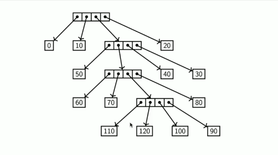
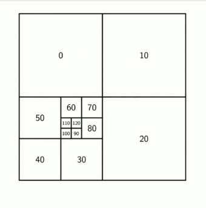
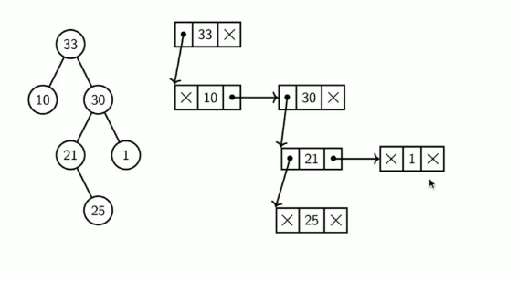
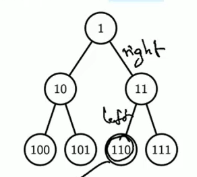

# Trees

VERY AWESOME DSA NOTES BY JH


## Binary Trees

A tree is a binary tree if each node has at most 2 children.

* What is the maximal size of a binary tree with height n? 2^(n + 1) - 1.
* How many leaves does this tree have? 2^n (since the tree is complete).
* What is the minimal height of a binary tree of size n? log(n).
* What is the maximal height of a binary tree with n vertices? n - 1.

I presume that height is 0-indexed? Hence the -1 term.


Usually stored like so:

*The lecture uses integers but generics are simple enough.*

```java
class BTNode<T> {
    T data;
    // These may be null.
    BTNode<T> left;
    BTNode<T> right;
}
```

### How might we flatten a binary tree into a list?

```java
public List<T> flatten() {
    if (this == null)
        return;

    List<T> out = new ArrayList<>();

    out.append(this.left.flatten());
    out.push(data);
    out.append(this.right.flatten());

    return out;
}
```

* Write the input if this was outputted by `flatten`. `[3, 7, 4, 0, 5, 2, 6]`

## Quad Trees

A *quad tree* is a type of tree where:

* Each internal node has exactly 4 children.
* Only leafs usually contain values. Internal nodes may be null.

### Diagram of a Quad Tree



And this is a neat way to represent an idea like this.



### How is this used in maps?

It is helpful for zooming in, you could split the map into 4 quadrants on screen, with their children being pointers to higher resolution grid pieces.

### What about rotating Quad Trees?

```java
class QTNode {
    Integer val;
    QTNode tr;
    QTNode tl;
    QTNode ll;
    QTNode lr;

    // This is left as an excercise for me.
}
```

## Ways to implement trees

* Basic: nodes store a value and left, right (child) pointers.
* Sibling List: Use nodes with a value field, child pointer and pointer to next sibling.



This approach is good for trees with variable numbers of child nodes.

* Array, indexed by `2n`, `2n + 1` for left and right nodes etc.

`tree[0]` is typically empty, so we might have a list like so `[X, 1, 10, 11, 100, 101, 110, 111]` represented as such:



## Breadth-First and Depth-First Search

Recall the `flatten` function I wrote earlier. Note that it goes as far as possible down the left subtree, visits the parent, then exhausts the right subtree. This is DFS.

[DFS Code](#how-might-we-flatten-a-binary-tree-into-a-list)


# Digression: Invariants

* An _invariant_ is a condition on code that must always be true during the execution of a section of code.

* They are important because they specify conditions that must be met and maintained in parts of the code.

* We can use them to mathematically prove a program is correct.

* We may use assertions to debug code and ensure invariants hold.

## BFS

BFS requires a queue.

```java
public boolean bfs(Node<T> n, T val)
{
    if (n == null) return false;

    Queue<Node<T>> q = new Queue<>();
    q.enqueue(n);
    while (!q.isEmpty())
    {
        Node<T> node = q.dequeue();
        if (node.val == val) return true;

        q.enqueue(node.left);
        q.enqueue(node.right);
    }

    return false;
}
```

## DFS (again because why not)

```java
public boolean dfs(Node<T> n, T val)
{
    if (n == null) return false;
    if (n.val.equals(val)) return true;

    return dfs(n.left, val) || dfs(n.right, val);
}
```


_Here is an implementation with a stack:_

```java
public boolean dfs(T val)
{
    if (this == null) return false;

    Stack<Node<T>> s = new Stack<>();
    s.push(this);
    while (!s.isEmpty())
    {
        Node<T> n = s.pop();

        if (n == null) continue;
        if (n.val.equals(val)) return true;

        s.push(n.left);
        s.push(n.right);
    }

    return false;
}
```

BFS has a time and space complexity of O(n).
DFS has a time complexity of O(n) and a space complexity of O(height).
